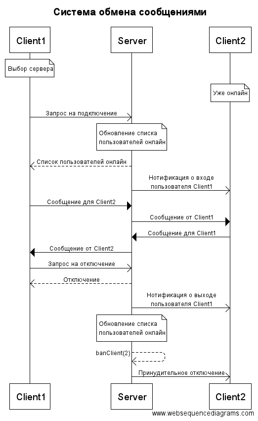
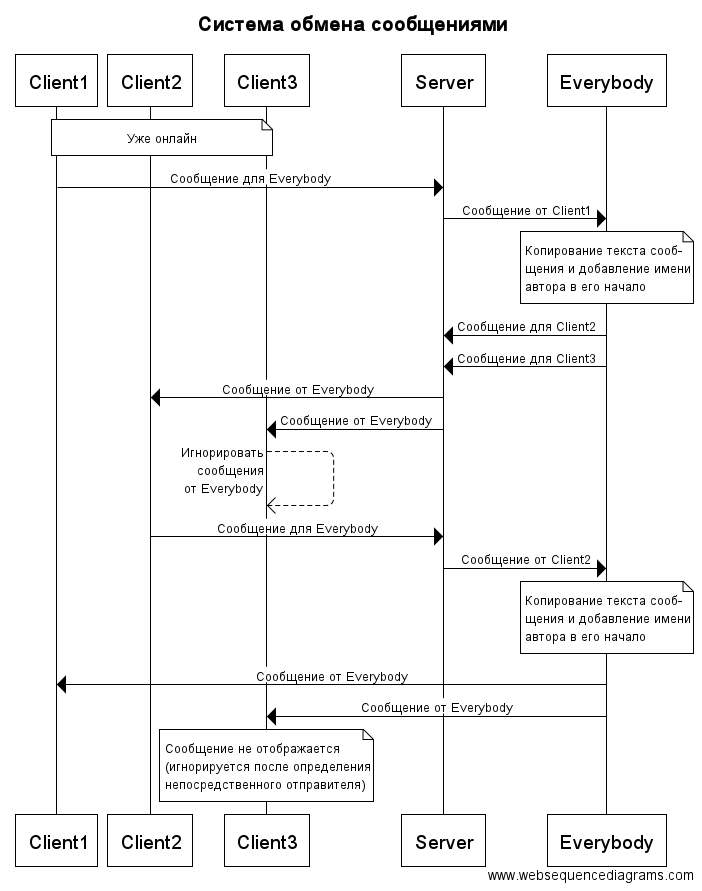
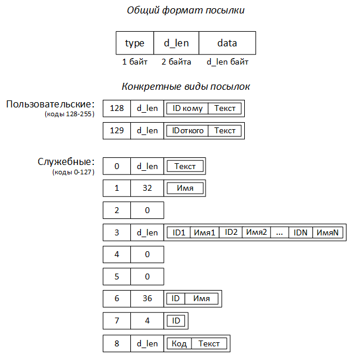

# chatTCP_linsrv
Система обмена сообщениями по протоколу TCP - сервер на Linux

Диаграммы последовательностей:

Исходя из диаграмм можно составить следующую семантику посылок:

- Посылки делятся на две группы: служебные и пользовательские.
- Пользовательские посылки предназначаются для общения клиентов друг с другом (посредством сервера).
- Служебные посылки предназначаются для общения клиентов с сервером.
- Виды пользовательских посылок:
 128. Исходящее сообщение от клиента (отправляется от клиента серверу). Содержит текст сообщения и идентификатор пользователя, которому оно предназначено.
 129. Входящее сообщение клиента (отправляется от сервера клиенту). Содержит текст сообщения и идентификатор пользователя, от которого оно исходит.
- Виды служебных посылок:
 0. Сообщение от сервера. Содержит некий текст, который сервер желает передать клиенту.
 1. Запрос на подключение. Содержит имя клиента, который желает подключиться к серверу (идентификатор ему присвоит сервер).
 2. Запрос на отключение. Передается намерение клиента отключиться от сервера.
 3. Ответ на запрос подключения. Передается клиенту от сервера в случае успешного подключения. Содержит список пользователей онлайн.
 4. Ответ на запрос отключения. Информирует клиента о том, что он будет отключен в ближайшее время.
 5. Принудительное отключение. Информирует клиента о том, что он будет отключен в ближайшее время по инициативе сервера.
 6. Нотификация о входе. Передается сервером клиенту, когда подключается новый пользователь. Содержит идентификатор и имя этого пользователя.
 7. Нотификация о выходе. Передается сервером клиенту, когда некоторый пользователь (кроме целевого) отключается. Содержит идентификатор этого пользователя.
 8. Сообщение об ошибке. Информирует клиента о том, что на сервере произошла ошибка. Содержит код ошибки и её текстовое описание.

Синтаксис посылок описан на следующей схеме:

